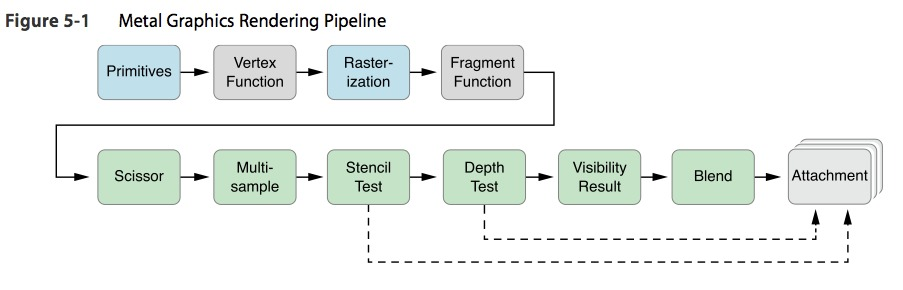
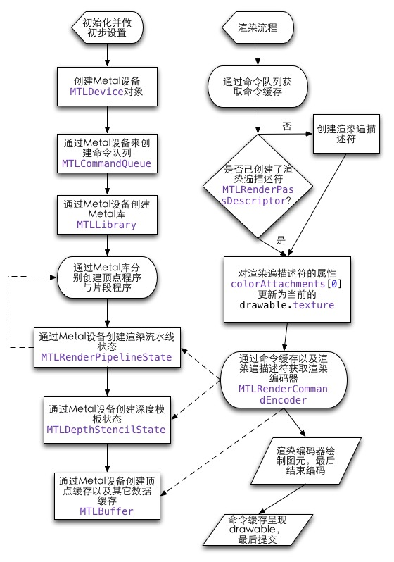

# iOS开发--Metal
在我的iOS编程生涯中可以说第一次接触这种技术,原先在编程中大多数做的都是一些商城类,视频类的APP,所以说如果要想实现这中技术,我就要从头开始学起,下面是在网上查找的一些学习的资料和学习的大概顺序.
学习大纲(顺序) Metal -> OpenGL -> SceneKit -> U3D

#Metal
 
苹果在2014年最新推出的Metal框架支持GPU硬件加速、高级3D图形渲染以及大数据并行运算。且提供了先进而精简的API来确保框架的细粒度(fine-grain)，并且在组织架构、程序处理、图形呈现、运算指令以及指令相关数据资源的管理上都支持底层控制。其核心目的是尽可能的减少CPU开销，而将运行时产生的大部分负载交由GPU承担。
而metal技术正是可以让我们在移动端体验主机端画质的引擎。据悉，这一技术可以让开发者们在编写游戏项目的过程中直接使用metal，也就是说可以实现让开发者在iOS设备中直接访问3D图像软件。
根据官方介绍，metal技术是专门为A7处理器芯片设计的，内置3D图像，可以让玩家在搭载A7以上iOS设备中享受精致的次世代画质。苹果的这一个全新的技术主要是为了提高3D图像10倍的渲染性能，从而让更多的游戏拥有超高画质的Level迈进，让手游的画质也可以达到像端游那样的精致。
###使用Metal的好处

最大的好处就是相比OpenGL ES而言可以大大的减少资源开销。当使用OpenGL来创建一段缓存或者纹理，往往会产生一份拷贝以防GPU在使用这段数据时有其他的访问(译者按：比如来自CPU的访问)。如果想要在确保数据安全的情况下拷贝缓存区或是纹理这样的大资源，那么产生的消耗会是相当大的。而反观Metal，就会发现它并无需这样的处理方式，开发者可以在CPU和GPU之间同步使用这些数据。为此苹果还提供了一个更为优秀的接口使得这种同步访问的情况变得更为容易：Grand Cnetral Dispatch(GCD技术)。不过使用Metal同样能做到这点，所谓先进的引擎就是能避免产生拷贝的情况下高效渲染那些需要加载或撤掉的资源。

另一大好处就是Metal能预判GPU的状态从而避免那些多余的校验和编辑。在使用OpenGL的时候，习惯上我们会挨个儿设置GPU的状态，然后每次进行绘制调用之前必须要校验一道GPU的状态。在最糟糕的情况下你甚至需要为了一个新的GPU状态重编译一遍阴影效果，当然，在这里采用预判GPU状态就显得相当必要了。不过Metal另辟蹊径，在初始化渲染引擎的时候，GPU的状态会被打包进一个预估的渲染通道，(render pass)，此状态下渲染通道会与多种资源一起被使用，而其他的状态不会有任何影响。Metal使用的渲染通道不需要多余的校验，因而最大限度的减少了API负载，且对于每一帧的渲染都有质的提升。

### Metal Framework
Metal的图形渲染流水线如下图所示


而通用计算流水线就没那么复杂了，主机端的数据直接送给Compute Shader之后就直接再输出给主机端。上图中，灰色框框的Vertex Shader与Fragment Shader就是我们要自己对GPU编程的部分，其余的框框全是GPU硬件单元，不需要我们自己来编程。但是有些单元需要我们自己设置指定的状态来使它们做特定的操作。比如Stencil Test当我们启用了它之后才会进行，还有Depth Test也是如此，而Blend启用了它之后可以选择多种不同的操作参数来指定Blend硬件单元如何做当前颜色与背景色的混合。

##### 渲染流水线的基本执行模型
我们在使用Metal时，通常会先对一些资源做初始化设置，同时，这些资源将在整个执行过程中一直被保留，有些甚至不会被修改。然后，是做渲染过程。渲染过程可以通过定时器或其它刷新方式不断地执行。里面所含有的资源是瞬时的，即仅仅在一个渲染过程内有效。一次渲染过程又可以称为一个渲染遍（render pass）。

在Metal整个执行过程中，以下资源是要被长久保留的，即它们的生命周期与你的Metal layer一样长：

命令队列（Command Queue）、缓存（Buffer）、纹理（Texture）、采样器状态（Sampler State）、库（Library）、计算状态（Compute State）、渲染流水线状态（Render Pipeline State）、深度／模板状态（Depth/Stencil State）。

而这些资源是瞬时的：命令缓存（Command Buffer）、命令编码器（Command Encoder）。

下图描述了一个图形渲染流水线的基本执行流程：


上图中，矩形框表示创建的对象为持久保留的，圆边矩形框表示创建或获得的资源是瞬时的，即在当前过程完成之后就被释放。实线箭头表示流水过程，虚线箭头A ---> B表示对象A对对象B有所引用。


### 编写一个基本的Metal程序
##### 使用UIKit创建设备(Device)和接口 
在Metal中，设备(Device)被作为GPU抽象概念，被用于去创建其他的对象，包括缓存、材质以及函数库。使用MTLCreateSystemDefaultDevice()方法可以获取默认设备:

```
id device = MTLCreateSystemDefaultDevice();
```
创建一个Metal层并将其作为UIView背景层的子层代码如下:

```
CAMetalLayer *metalLayer = [CAMetalLayer layer];
metalLayer.device = device;
metalLayer.pixelFormat = MTLPixelFormatBGRA8Unorm;
metalLayer.frame = view.bounds;
[view.layer addSublayer:self.metalLayer];
```
注:CAMetalLayer是CALayer的子类，能够表现一个Metal framebuffer中的内容。我们需要告知图层metalLayer我们使用了那个device(就是刚刚创建的那个)，并设置其显示格式，在这里设置的是8bit通道BGRA的格式，也就是说每个像素包括蓝、绿、红以及Alpha(透明度)四个值，每个值的取值范围为0-255。
##### 函数和库
Metal程序中大多数功能是依照顶点和片段功能来写的，通俗点说就是着色器。Metal的着色器是Metal Shading language写的.Metal的一大优势就在于着色功能是在应用生成中间代码时才编译，并在应用启动时保存有效时间值。
Metal库就是对于各种功能集合。你在自己的项目中所写的所有着色器功能都会编译进这个默认的库里面，它们可以从你的device里面提取恢复：

```
id library = [device newDefaultLibrary]
```
注:这个库用于下面构建渲染管线状态
##### 指令序列
所有指令会被集结为指令序列之后提交到Metal device，指令序列允许指令在线程安全的情况下改变或者序列化他们的执行。你可以直截了当的创建一个指令序列：

```
id commandQueue = [device newCommandQueue];
```
##### 创建线管
Metal中的管线编程，也就意味着顶点数据在被渲染的时候会发生不同寻常的变化。顶点着色器和片段着色器都是可编程渲染管线，另外也还有一些其他的必要的操作(比如剪切、光栅扫描、视口变换)则不需要我们直接去控制。后面这些不需要去控制的特性则组成了固定渲染管线。

在Mrtal中创建管线的时候，我们需要分别对每个顶点和像素指定使用哪种顶点和片段函数。同样还需要告知管线在frambuffer中的像素格式。在这种情况下，Metal要求像素格式必须与图层的格式匹配，因为这样才能将其绘制到屏幕上。
从库中使用其名字调用这些函数：

```
id vertexProgram = [library newFunctionWithName:@"vertex_function"];//顶点函数
id fragmentProgram = [library newFunctionWithName:@"fragment_function"];//片段函数
```
创建一个管线描述符并使用其方法和像素格式来配置。

```
    MTLRenderPipelineDescriptor *pipelineStateDescriptor = [[MTLRenderPipelineDescriptor alloc] init]; 
[pipelineStateDescriptor setVertexFunction:vertexProgram];
[pipelineStateDescriptor setFragmentFunction:fragmentProgram]; 
pipelineStateDescriptor.colorAttachments[0].pixelFormat = MTLPixelFormatBGRA8Unorm;
```
最后我们利用描述符来创建管线态(pipeline state)，这样在程序运行的时候它就会根据硬件将中间代码优化之后编译着色器功能。

```
id pipelineState = [device newRenderPipelineStateWithDescriptor:pipelineStateDescriptor error:nil];
```
##### 加载数据到Buffer(缓冲区)中
现在我们已经成功创建了管线，当然还需要将其填满数据。在本例中，我们只需要绘制一个简单的几何图形：旋转的正方形。它由两个共边的直角三角形组成。

```
static float quadVertexData[] = 
{ 
     0.5, -0.5, 0.0,1.0,      1.0, 0.0, 0.0, 1.0,
     -0.5, -0.5, 0.0, 1.0,      0.0, 1.0, 0.0, 1.0, 
     -0.5, 0.5, 0.0, 1.0,      0.0, 0.0, 1.0, 1.0,
     0.5, 0.5, 0.0, 1.0,      1.0, 1.0, 0.0, 1.0,
     0.5, -0.5, 0.0, 1.0,      1.0, 0.0, 0.0, 1.0,
      -0.5, 0.5, 0.0, 1.0,      0.0, 0.0, 1.0, 1.0,
};
```
注:每一行的前四个值分别表示每个顶点的x,y,z,w值(译者按:即四元数)，后面四个数代表的是红、绿、蓝和Alpha值。

要使用Metal来绘制顶点数据，我们需要先把数据放进一个Buffer中，这个Buffer就是存在于内存中能被CPU和GPU共享的非结构化二进制串。

```
vertexBuffer = [device newBufferWithBytes:quadVertexData 
                                   length:sizeof(quadVertexData) 
                                  options:MTLResourceOptionCPUCacheModeDefault];
```
我们还需要另一个Buffer来存储旋转矩阵以便让正方形旋转，仅需创建一个指定长度的Buffer为其提供空间就行了，不需要预先初始化数据：

```
uniformBuffer = [device newBufferWithLength:sizeof(Uniforms) 
                                    options:MTLResourceOptionCPUCacheModeDefault];
```
##### 动画
下面的Uniform结构体仅有一个4×4旋转矩阵作为成员，类型是matrix_float4x4，这是苹果SIMD库中的数据结构，这个库中包含了多种适用于数据并行处理的类型：

```
typedef struct
{ 
     matrix_float4x4 rotation_matrix; 
} Uniforms;
```
为了成功复制旋转矩阵的数据到缓存中，我们需要得到指向其数据的指针然后使用memcpy来拷贝数据:

```
Uniforms uniforms; 
uniforms.rotation_matrix = rotation_matrix_2d(rotationAngle); 
void *bufferPointer = [uniformBuffer contents]; 
memcpy(bufferPointer, &uniforms, sizeof(Uniforms));
```
##### 准备绘制
在绘制之前先要从图层中获取drawable，该对象管理了一组用于渲染的纹理：

```
id drawable = [metalLayer nextDrawable];
```

然后创建一个MTLRenderPassDescriptor，用于描述Metal在渲染先后需要完成的操作。下面我们将使用它来清除framebuffer然后用白色填充，然后执行绘制调用，最后将结果存储在frambuffer中显示出来。

```
MTLRenderPassDescriptor *renderPassDescriptor = [MTLRenderPassDescriptor renderPassDescriptor]; 
renderPassDescriptor.colorAttachments[0].texture = drawable.texture; 
renderPassDescriptor.colorAttachments[0].loadAction = MTLLoadActionClear; 
renderPassDescriptor.colorAttachments[0].clearColor = MTLClearColorMake(1, 1, 1, 1); 
renderPassDescriptor.colorAttachments[0].storeAction = MTLStoreActionStore;
```
##### 发布绘制调用
使用指令序列需要现将它们编码进指令缓存中，指令缓存就是将已经按照GPU能理解的方式编码的指令集合。：
	
```
id commandBuffer = [self.commandQueue commandBuffer];
```

为了真正的对指令序列进行编码，需要一个对象来将所有的绘制调用转换为GPU能够读取的语言。这一对象类型叫做MTLRenderCommandEncoder，可以通过向指令缓存区请求编码以及之前创建的描述符来创建

```
MTLRenderCommandEncoder：
id renderEncoder = [commandBuffer renderCommandEncoderWithDescriptor:renderPassDescriptor];
```

在调用之前，需要用前面预编译好的管线态(pipeline state)来配置渲染指令的编码器，然后设置这段缓存，这段缓存将作为我们顶点着色器的参数：

```
[renderEncoder setRenderPipelineState:pipelineState]; 
[renderEncoder setVertexBuffer:vertexBuffer offset:0 atIndex:0]; 
[renderEncoder setVertexBuffer:uniformBuffer offset:0 atIndex:1];
```

为了能渲染出几何形状，我们要告诉Metal我们希望绘制哪一种图形(三角形)，以及需要从缓存区中解析出多少个顶点(在本例中是六个)：
```
[renderEncoder drawPrimitives:MTLPrimitiveTypeTriangle vertexStart:0 vertexCount:6];
```
最后告知编码器我们已经完成了绘制调用的分发，调用endEncoding：

```
[renderEncoder endEncoding];
```
##### Framebuffer(帧缓冲区)的呈现
现在我们的绘制调用已经准备妥当，于是需要告知指令缓存区将结果显示到屏幕上。在此调用presentDrawable方法并以drawable为参数：

```
[commandBuffer presentDrawable:drawable];
```
通知缓存区准备执行，使用commit方法：

```
[commandBuffer commit];
```
##### Metal 着色语言(Shading Language)
为了能在着色器中使用顶点数据，我们要定义一个结构体类型，相当于将顶点的布局用Objective-C来表示。

```
typedef struct
{ 
float4 position; 
float4 color; 
} VertexIn;
```

我们还另需要一个相似的的结构体来描述从顶点着色器到片段着色器传递的顶点类型。不过，在这种情况下，需要确定结构中的哪个成员应该被认为是顶点的位置信息(通过使用[[position]])。
	
```
typedef struct 
{ 
float4 position [[position]]; 
float4 color; 
} VertexOut;
```

顶点函数会对每个顶点都执行一次，它接受的一个指向全部顶点、统一数据的相关信息以及旋转矩阵的指针。第三个索引参数则告诉函数当前的顶点的操作。

注意顶点函数的的参数是根据函数用途不同安排的。在本例中的所用的buffer参数中，参数的索引相当于我们在设置渲染指令编码器的时候指定的索引。这也是Metal分辨这些参数谁是谁的方法。

在顶点函数中，我们将顶点位置与旋转矩阵相乘。我们之前定的旋转矩阵能够使正方形围绕它的中心旋转，我们将变换后的数据存储在输出顶点中，顶点颜色则完全拷贝输入顶点：

```
vertex VertexOut vertex_function(device VertexIn *vertices [[buffer(0)]], 
                                 constant Uniforms &uniforms [[buffer(1)]], 
                                 uint vid [[vertex_id]]) 
{ 
     VertexOut out; 
     out.position = uniforms.rotation_matrix * vertices[vid].position; 
     out.color = vertices[vid].color; 
     return out; 
}
```

片段函数则是对每个像素执行一次，所需参数则是Metal在光栅化过程中生成的，这一过程还会对每个顶点中指定的颜色和位置信息进行插值。在这个简单的片段函数中，我们传出的插值颜色是Metal已经算好的，就是最终显示在屏幕上的像素的颜色值。

```
fragment float4 fragment_function(VertexOut in [[stage_in]]) 
{ 
return in.color; 
}
```

